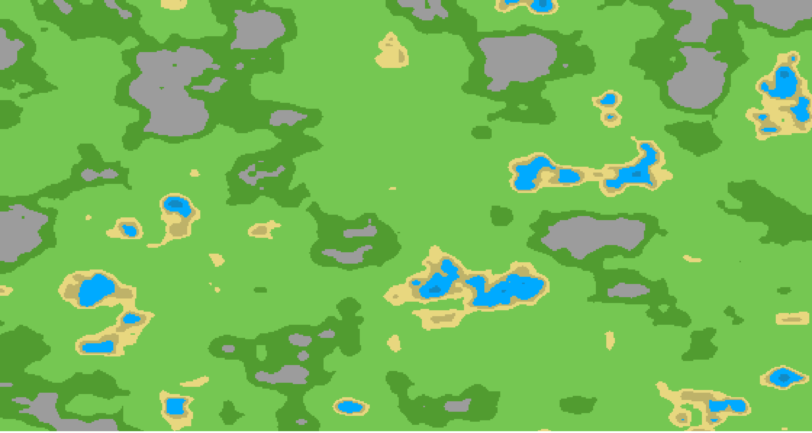
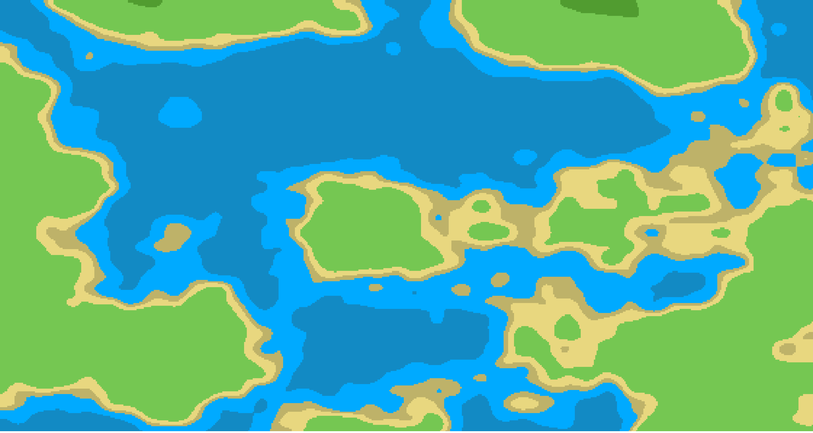
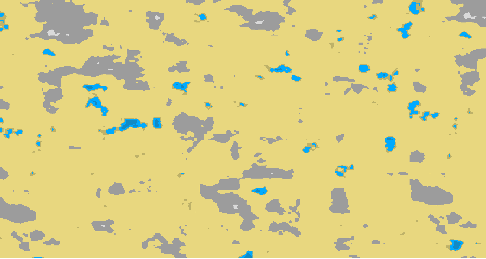

## Biom generator
[](https://npmjs.com/package/biom-generator)
[](https://github.com/neki-dev/biom-generator/blob/master/dist/index.js)
[](https://github.com/neki-dev/biom-generator/actions)

Generation random map with bioms

Example 1 | Example 2 | Example 3
--|---|--
 |  | 

.

* ### Install

```sh
npm i biom-generator
```

* ### Usage

```js
generateMap(
    // List of bioms parameters
    bioms: Biom[],
    // Generation parameters
    parameters: GenerationParameters
): number[][]
```

* ### Biom parameters

Parameter   | Description               | Type
----------- | ------------------------- | -------
`tileIndex` | Texture index for tilemap | number
`level`     | Biom breakpoint (height)  | number

* ### Generation parameters

Parameter        | Description                     | Type      | Default
---------------- | ------------------------------- | --------- | ----
`width`          | Map width                       | number    | 
`height`         | Map height                      | number    | 
`frequency`      | Map detalization                | number    | 10
`redistribution` | Degree of increase in recession | number    | 1.1
`octaves`        | Perlin octaves                  | number    | 4
`ampFalloff`     | Gain smoothing                  | number    | 0.5
`regenerateSeed` | Regenerate cached seed          | boolean   | false
`fillEmpty`      | Tile index for empty bioms      | number    | null

* ### Example

```js
const generateMap = require('biom-generator');

const BIOMS = {
    WATER: 0,
    GRASS: 1,
    MOUNTS: 2,
};

const biomList = [{
    tileIndex: BIOMS.WATER,
    level: 0.15,
}, {
    tileIndex: BIOMS.GRASS,
    level: 0.60,
}, {
    tileIndex: BIOMS.MOUNTS,
    level: 1.00,
}];

const tilemap = generateMap(biomList, {
    width: 500,
    height: 400,
});
```